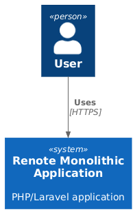
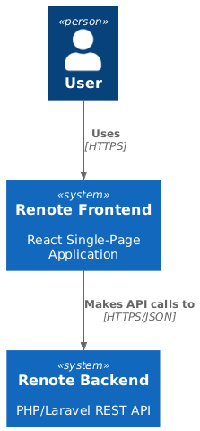
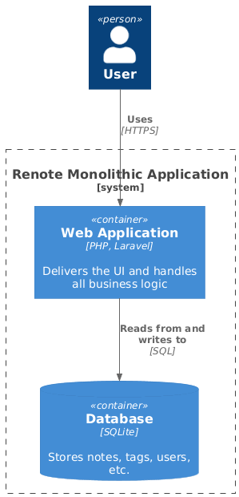
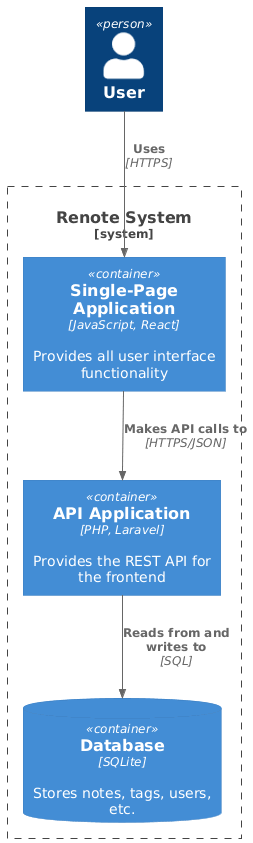

# Plan de Migration : Application Renote

## 1. Introduction

Ce document décrit le plan de migration pour l'application Renote. L'objectif est de faire évoluer l'application monolithique actuelle basée sur PHP vers une architecture moderne et découplée. Cela impliquera la séparation du frontend et du backend, l'introduction d'une API RESTful et l'utilisation de React pour le frontend. Cette migration permettra de supporter les appareils mobiles et les services externes à l'avenir.

## 2. Architecture Actuelle

L'application Renote est actuellement une application monolithique construite avec Laravel.

- **Architecture :** Orientée serveur, où le backend est étroitement couplé au frontend.
- **Frontend :** Les vues HTML sont rendues directement par le backend PHP à l'aide du moteur de templating Blade de Laravel et de Livewire pour les composants dynamiques.
- **Backend :** La logique métier, l'accès aux données et le rendu des vues sont souvent gérés dans les mêmes fichiers PHP.
- **Pile Technologique :**
    - PHP / Laravel
    - JavaScript (avec Vite et Tailwind CSS)
    - Livewire (Volt et Flux)
    - SQLite

## 3. Architecture Cible

L'objectif est une architecture entièrement découplée et pilotée par le client.

- **Frontend :**
    - **Framework :** React (dernière version stable) avec JSX.
    - **Styling :** Modules CSS ou styles simples. Tailwind CSS peut être réutilisé.
    - **Gestion d'État :** Une bibliothèque dédiée comme Redux, Zustand ou MobX sera utilisée pour gérer l'état de l'application, en séparant les composants de l'interface utilisateur, la logique d'état (stores, actions, sélecteurs) et les effets secondaires (appels API).
    - **Architecture :** Pilotée par le client, avec tout le rendu et la logique de l'interface utilisateur gérés par l'application React.

- **Backend :**
    - **Framework :** PHP (>=8.4) avec Laravel.
    - **Architecture :** Un backend uniquement API suivant les principes MVC et les patrons de conception SOLID.
        - **Contrôleurs :** Axés sur des cas d'utilisation spécifiques.
        - **Modèles :** Pour l'accès aux données (Eloquent sera conservé).
        - **Services :** Pour encapsuler la logique métier.

- **Communication :**
    - **API :** Une API RESTful sera le point de communication unique entre le frontend et le backend.
    - **Format de Données :** Format de réponse JSON cohérent (`{status, message, data}`).
    - **Protocole :** HTTP/S avec des codes de statut explicites.

### Justification des Choix Architecturaux

-   **Architecture Découplée :** La séparation du frontend et du backend permet un développement, un déploiement et une mise à l'échelle indépendants. Elle améliore la maintenabilité en permettant aux équipes de se spécialiser dans les technologies frontend ou backend. Ce découplage est essentiel pour atteindre l'objectif du projet de supporter de futurs clients comme les applications mobiles ou les services tiers, qui pourront tous consommer la même API sous-jacente.

-   **Frontend React :** React est une bibliothèque mature, largement adoptée, avec un vaste écosystème et un fort soutien communautaire. Son architecture basée sur des composants favorise la réutilisabilité du code et simplifie le développement d'interfaces utilisateur complexes et interactives. Le choix de React s'aligne sur les pratiques modernes de développement web et garantit l'accès à un large bassin de talents et à un riche ensemble d'outils et de bibliothèques tiers.

-   **Backend Laravel uniquement API :** Transformer l'application Laravel existante en un backend uniquement API est une décision stratégique pour tirer parti de la base de code actuelle et de l'expertise de l'équipe. Laravel fournit une base robuste, sécurisée et efficace pour la construction d'API RESTful, avec des fonctionnalités puissantes comme l'ORM Eloquent et Laravel Sanctum pour l'authentification. Cette approche accélère le développement en réutilisant la logique métier existante tout en adaptant l'application à un monde découplé.

-   **API RESTful avec JSON :** Une API RESTful est un moyen standard, prévisible et évolutif de construire des services web. Elle s'appuie sur les méthodes HTTP standard et les codes de statut, ce qui la rend facile à consommer pour tout client (web, mobile ou autres services). JSON est la norme de facto pour l'échange de données sur le web en raison de sa légèreté et de son format lisible par l'homme, assurant une communication efficace entre le frontend et le backend.

## 4. Stratégie de Migration

Nous adopterons le **Pattern Strangler Fig** pour une migration progressive et sûre. Cette approche évite une réécriture risquée "big bang" en remplaçant progressivement les fonctionnalités existantes par de nouvelles applications et services.

### Justification de la Stratégie de Migration

-   **Pattern Strangler Fig :** Ce pattern est choisi pour ses avantages significatifs en matière de réduction des risques. Au lieu d'une réécriture à haut risque, tout ou rien, nous pouvons "étrangler" progressivement l'ancienne application monolithique en remplaçant progressivement ses fonctionnalités par de nouveaux services découplés. Cette approche permet un déploiement par étapes, un retour d'information continu de l'utilisateur et garantit que l'application reste stable et fonctionnelle tout au long du processus de migration. Elle minimise les perturbations et permet à l'équipe de fournir de la valeur en continu.

### Phase 0 : Préparation et Échafaudage de l'API

1.  **Configuration de l'environnement :**
    -   Créer un nouveau répertoire `renote-react-app` pour l'application React.
    -   Initialiser un nouveau projet React en utilisant Vite.
    -   Installer la bibliothèque `zustand` pour la gestion d'état 
2.  **Échafaudage de l'API :**
    -   Dans l'application Laravel existante, créer un nouvel ensemble de routes API dans `routes/api.php`.
    -   Implémenter l'authentification API en utilisant Laravel Sanctum pour une communication sécurisée avec le frontend.
    -   Définir un format de réponse JSON standard à utiliser pour tous les points d'API.

### Phase 1 : Migration de la Fonctionnalité "Tags"

1.  **Backend (Points d'API) :**
    -   Créer des points d'API pour une gestion simple des tags :
        -   `GET /api/tags`
        -   `POST /api/tags`

2.  **Frontend (Composants React) :**
    -   Développer des composants React pour :
        -   Gérer les tags.
        -   Associer des tags aux notes.
    -   Intégrer la gestion des tags dans l'application React.

### Phase 2 : Migration de la Fonctionnalité "Notes"

1.  **Backend (Points d'API) :**
    -   Créer des points d'API pour la gestion des notes :
        -   `GET /api/notes` (Lister toutes les notes)
        -   `POST /api/notes` (Créer une nouvelle note)
        -   `GET /api/notes/{id}` (Afficher une seule note)
        -   `DELETE /api/notes/{id}` (Supprimer une note)
    -   Implémenter les contrôleurs et la logique de service correspondants pour ces points d'API.

2.  **Frontend (Composants React) :**
    -   Développer des composants React pour :
        -   Afficher la liste des notes (`NoteList`).
        -   Créer une note (`NoteForm`).
    -   Implémenter la gestion d'état pour la fonctionnalité des notes.

3.  **Intégration :**
    -   Créer une nouvelle vue Blade qui sert de point d'entrée pour l'application React.
    -   Mettre à jour la route principale (`/notes`) pour charger cette nouvelle vue Blade, remplaçant ainsi la page de notes basée sur Livewire par l'application React.

### Phase 3 : Migration de l'Authentification

1.  **Backend (Points d'API) :**
    -   S'assurer que les points d'API pour l'authentification sont en place :
        -   `POST /login`
        -   `POST /register`
        -   `POST /logout`

2.  **Frontend (Composants React) :**
    -   Créer des composants React pour la connexion, l'inscription et d'autres pages liées à l'authentification.
    -   Implémenter le routage côté client et la gestion d'état pour l'authentification.
    -   L'application React gérera désormais tous les flux d'authentification.

### Phase 4 : Mise hors service de l'ancienne interface utilisateur

1.  **Finalisation :**
    -   Remplacer la gestion des routes et des transitions de livewire à l'aide de `react-router-dom`.
    -   L'application Laravel ne sera désormais responsable que de servir l'API et le fichier HTML initial qui charge l'application React.

2.  **Nettoyage :**
    -   Une fois toutes les fonctionnalités migrées avec succès vers le frontend React, nous pouvons commencer à supprimer l'ancien code.
    -   Supprimer les anciennes vues Blade, les composants Livewire et les routes qui ne sont plus utilisés.
    -   Supprimer les feature flipping mis en place pour garantir une expérience utilisateur cohérente.

## 5. Risques et Atténuation

-   **Risque :** Introduction de bogues pendant la migration.
    -   **Atténuation :** Chaque phase sera minutieusement testée. Nous écrirons des tests unitaires et d'intégration pour les nouveaux points d'API et les composants React. De plus chaque fonctionnalité réécrite sera déployée en production en plusieurs étapes avec un feature flag afin de minimiser les risques et pouvoir revenir en arrière si nécessaire.

-   **Risque :** Problèmes de performance avec la nouvelle API.
    -   **Atténuation :** Les performances de l'API seront surveillées. Nous mettrons en œuvre des stratégies de mise en cache et optimiserons les requêtes de base de données si nécessaire.

-   **Risque :** Perturbation pour les utilisateurs existants.
    -   **Atténuation :** L'approche par phases garantit que l'application reste fonctionnelle tout au long de la migration. Nous utiliserons des indicateurs de fonctionnalité pour déployer de nouvelles fonctionnalités progressivement si nécessaire.

## 6. Schémas d'Architecture (Modèle C4)

Voici les diagrammes du modèle C4 représentant les architectures actuelle et cible.

| Architecture Actuelle                                                     | Architecture Cible                                                            |
|--------------------------------------------------------------------------:|:---------------------------------------------------------------|
|       |              |
|  |  |
